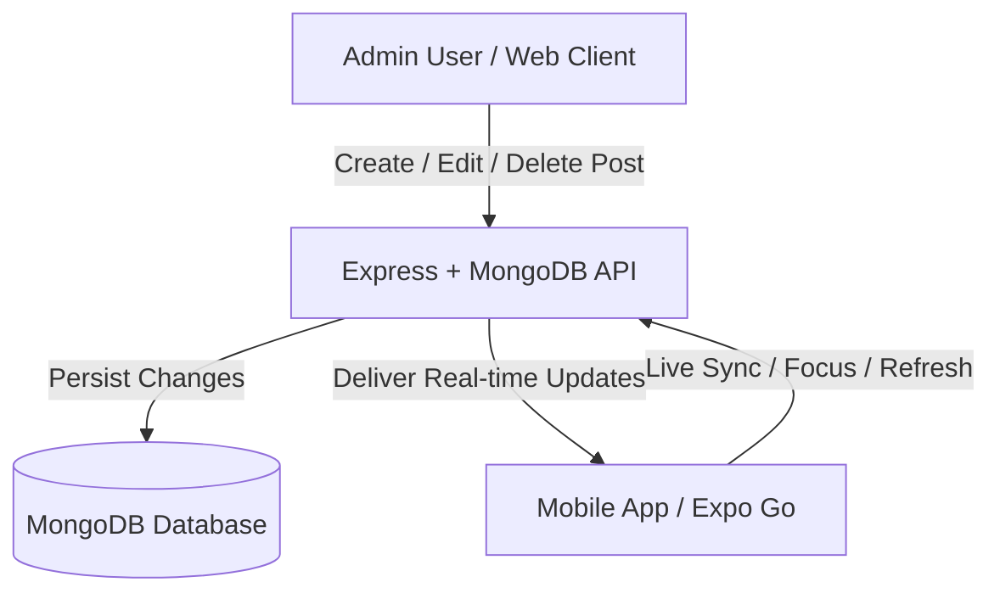

# 🚀 BlogVerse — Full-Stack MERN & React Native Mobile Platform

> **BlogVerse** is a modern, high-performance developer blogging and learning platform built using the **MERN Stack** (MongoDB, Express, React, Node.js) along with a companion cross-platform **React Native Expo** mobile application. Both web and mobile applications share a real-time synchronized backend API, featuring dark/light modes, interactive Markdown reading/editing, secure SVG Captcha authentication, and media uploads.

---

## 📑 Table of Contents

- [Overview](#-overview)
- [Architecture & Folder Structure](#-architecture--folder-structure)
- [Key Features](#-key-features)
- [Tech Stack](#-tech-stack)
- [Getting Started](#-getting-started)
  - [1. Backend Server (`server/`)](#1-backend-server-server)
  - [2. Frontend Web Client (`client/`)](#2-frontend-web-client-client)
  - [3. Mobile Application (`mobile/`)](#3-mobile-application-mobile)
- [Real-Time Web & Mobile Synchronization](#-real-time-web--mobile-synchronization)
- [API Endpoints Reference](#-api-endpoints-reference)
- [Environment Configuration & Security](#-environment-configuration--security)
- [Building Android APK (EAS Cloud)](#-building-android-apk-eas-cloud)
- [Author & Acknowledgments](#-author--acknowledgments)

---

## 🌟 Overview

BlogVerse provides a unified ecosystem for reading, writing, and sharing programming tutorials and developer notes (SQL, Docker, Linux, Git, React, Next.js, and more):
- **Web App**: Built with React 18, Vite, Tailwind CSS, and Markdown parsing with syntax highlighting.
- **Mobile App**: Cross-platform React Native app powered by Expo SDK 54, matching the exact color aesthetic, smooth animations, safe-area layout, and full CRUD capabilities.
- **Backend API**: Secure REST API backed by MongoDB Atlas, Cloudinary image hosting, and in-memory SVG Captchas.

---

## 🗂️ Architecture & Folder Structure

```
Blog-website/
├── client/                     # Web Frontend (React + Vite + Tailwind CSS)
│   ├── src/
│   │   ├── components/         # Navbar, Footer, PostCard, Markdown, Captcha, PostForm
│   │   ├── pages/              # Home, BlogPost, CreatePost, EditPost, Login, Signup
│   │   ├── api.js              # Web API client
│   │   ├── AuthContext.jsx     # Authentication context & state
│   │   ├── theme.js            # Light/Dark theme switching logic
│   │   └── index.css           # Tailwind custom tokens & styles
│   ├── package.json
│   └── vite.config.js
│
├── mobile/                     # Mobile Application (React Native + Expo SDK 54)
│   ├── assets/                 # App icons, splash screens & adaptive icons
│   ├── src/
│   │   ├── components/         # Header, PostCard, Captcha, MarkdownViewer, MarkdownEditor, PostForm
│   │   ├── context/            # AuthContext with AsyncStorage session persistence
│   │   ├── navigation/         # RootNavigator (Stack + Bottom Tab Navigator)
│   │   ├── screens/            # Home, BlogPost, CreatePost, EditPost, Login, Signup, Tutorials, Profile
│   │   ├── services/           # api.js with live-sync & event listeners
│   │   └── theme/              # Color palettes (Dark/Light) & ThemeContext
│   ├── app.json                # Expo project configuration
│   ├── eas.json                # EAS standalone APK build settings
│   ├── package.json
│   └── App.js
│
└── server/                     # Backend API (Node.js + Express + MongoDB)
    ├── src/
    │   ├── models/             # Mongoose schemas (Post, User)
    │   ├── routes/             # auth.js, posts.js, upload.js
    │   ├── middleware/         # auth.js (JWT authentication & Admin authorization)
    │   ├── utils/              # captcha.js (svg-captcha generator)
    │   ├── db.js               # MongoDB connection
    │   ├── seedData.js         # Curated tutorial posts
    │   └── app.js              # Express app setup & security middleware
    ├── uploads/                # Local fallback image storage
    ├── .env                    # Environment variables (Mongo URI, JWT Secret, Cloudinary)
    └── package.json
```

---

## ✨ Key Features

### 🎨 Visuals & Theming
- **Dynamic Dark & Light Modes**: Sleek dark zinc palette (`#0a0a0b` / `#141417`) and crisp light surface (`#f8fafc` / `#ffffff`) accented by vibrant orange branding (`#f97316`).
- **Persistent State**: Theme preferences are automatically saved in `localStorage` on the web and `AsyncStorage` on mobile.
- **Safe Area Layout**: Mobile views handle modern smartphone display notches and navigation bars seamlessly.

### 📝 Markdown Reading & Editing
- **Interactive Markdown Viewer**: Renders headings, bold/italic, lists, blockquotes, responsive tables, and syntax-highlighted code blocks with a **one-tap Copy Code button**.
- **Full Markdown Toolbar Editor**: Mobile formatting toolbar (Bold, Italic, Headings H1/H2, Quotes, Code Blocks, Tables, Gallery Image Picker) with instant Live Preview switching.

### 🔒 Security & Authentication
- **Role-Based Access Control**: Admin-only operations for creating, editing, and deleting posts.
- **Dynamic SVG Captchas**: Server-generated SVG security checks on Login and Signup preventing bot spam.
- **JWT Authentication**: Secure token-based session management across both web and mobile.
- **Protected Environment**: All sensitive keys, secrets, and URLs are isolated in `.env` files and ignored in version control.

### 🔄 Real-Time Live Sync
- Changes made on the website (e.g. newly published or edited blog posts) reflect **automatically in the mobile app** via screen focus revalidation (`useFocusEffect`), background live sync listeners, and swipe-to-refresh (`RefreshControl`).

---

## 🛠️ Tech Stack

| Category | Technology |
|---|---|
| **Backend** | Node.js, Express.js, MongoDB Atlas, Mongoose, JWT, Multer, svg-captcha |
| **Cloud Storage** | Cloudinary (Image uploads with local fallback) |
| **Web Frontend** | React 18, Vite, Tailwind CSS, React Router v6, Highlight.js, Remark/Rehype |
| **Mobile Frontend** | React Native 0.81, Expo SDK 54, React Navigation v7, AsyncStorage, react-native-svg |
| **Build & Deploy** | EAS Build (Standalone Android APK), Render (Cloud Hosting), Vercel/Netlify |

---

## 🚀 Getting Started

### Prerequisites
- **Node.js**: v18.0.0 or higher
- **npm** or **yarn**
- **Git**
- **Expo Go App** (installed on your iOS or Android device for development preview)

---

### 1. Backend Server (`server/`)

1. Open terminal and navigate to `server`:
   ```bash
   cd server
   ```
2. Install dependencies:
   ```bash
   npm install
   ```
3. Create a `.env` file inside `server/` with the following keys:
   ```env
   PORT=5000
   MONGO_URI=mongodb+srv://<username>:<password>@cluster0.mongodb.net/blogwebsite
   JWT_SECRET=your_super_secret_jwt_key
   ADMIN_EMAILS=admin@example.com,admin@blogverse.dev

   # Cloudinary Credentials (Optional for cloud image storage)
   CLOUDINARY_CLOUD_NAME=your_cloud_name
   CLOUDINARY_API_KEY=your_api_key
   CLOUDINARY_API_SECRET=your_api_secret
   CLOUDINARY_FOLDER=blogverse
   ```
4. Seed initial tutorial posts (SQL, Docker, Linux, Git, etc.):
   ```bash
   npm run seed
   ```
5. Start the development server:
   ```bash
   npm run dev
   ```
   *Server runs on `http://localhost:5000`.*

---

### 2. Frontend Web Client (`client/`)

1. Open terminal and navigate to `client`:
   ```bash
   cd client
   ```
2. Install dependencies:
   ```bash
   npm install
   ```
3. Start Vite dev server:
   ```bash
   npm run dev
   ```
   *Web app opens at `http://localhost:5173`.*

---

### 3. Mobile Application (`mobile/`)

1. Open terminal and navigate to `mobile`:
   ```bash
   cd mobile
   ```
2. Install dependencies:
   ```bash
   npm install
   ```
3. Verify your `.env` file in `mobile/`:
   ```env
   EXPO_PUBLIC_API_URL=https://blog-website-jj8f.onrender.com
   ```
4. Start the Expo development server:
   ```bash
   # If running on local Wi-Fi:
   $env:REACT_NATIVE_PACKAGER_HOSTNAME="<YOUR_LOCAL_IP>"; npx expo start -c

   # Or in Tunnel mode (Works on Mobile Data / 5G):
   npx expo start --tunnel -c
   ```
5. Scan the QR code using the **Expo Go** app on your phone!

---

## 📡 Real-Time Web & Mobile Synchronization

Both the Web Client and Mobile App interact with the same centralized backend database:



1. **Focus Revalidation (`useFocusEffect`)**: When you switch tabs or resume the mobile app, fresh data is fetched instantly.
2. **Periodic Live Polling**: The mobile app checks for background updates periodically so new posts appear automatically without restarting.
3. **Pull-To-Refresh**: Native swipe-down gesture available on list feeds.

---

## 🔌 API Endpoints Reference

### 📰 Posts API (`/api/posts`)
| Method | Endpoint | Description | Auth Required |
|---|---|---|---|
| `GET` | `/api/posts?page=1&limit=6&q=search` | Paginated post list with title/author search | No |
| `GET` | `/api/posts/:slug` | Full post content by slug | No |
| `POST` | `/api/posts` | Create a new blog post | Yes (Admin) |
| `PUT` | `/api/posts/:slug` | Update an existing blog post | Yes (Admin) |
| `DELETE` | `/api/posts/:slug` | Delete a post | Yes (Admin) |

### 🔐 Authentication API (`/api/auth`)
| Method | Endpoint | Description | Auth Required |
|---|---|---|---|
| `GET` | `/api/auth/captcha` | Generates a one-time SVG Captcha | No |
| `POST` | `/api/auth/signup` | Register new user with Captcha verification | No |
| `POST` | `/api/auth/login` | Login user with email, password & Captcha | No |
| `GET` | `/api/auth/me` | Retrieve current authenticated user profile | Yes |

### 🖼️ Media Upload API (`/api/upload`)
| Method | Endpoint | Description | Auth Required |
|---|---|---|---|
| `POST` | `/api/upload` | Upload image (multipart/form-data) to Cloudinary/Local | Yes (Admin) |

---

## 📦 Building Android APK (EAS Cloud)

To generate a standalone `.apk` file that can be installed on any Android device without Expo Go:

1. Log into your Expo account:
   ```bash
   npx eas-cli login
   ```
2. Trigger the cloud build:
   ```bash
   npx eas-cli build -p android --profile preview
   ```
3. Once completed on EAS Cloud, download the `.apk` file directly to your phone and install!

---

## 👤 Author & Acknowledgments

- **Author**: [Sourav Kumar](https://github.com/sourav20975-oss)
- **LinkedIn**: [Sourav Kumar on LinkedIn](https://www.linkedin.com/in/sourav-kumar-20975s/)
- **Platform**: BlogVerse
- **License**: MIT License
